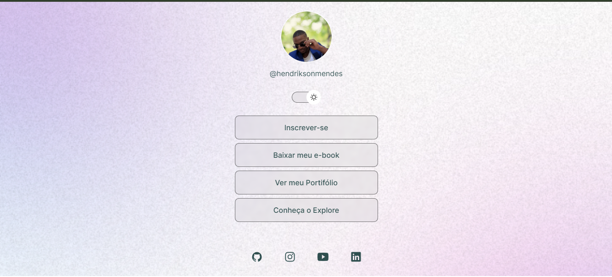

<<<<<<< HEAD
<h1 align="center"> Gerador de Links </h1>

Este programa exclusivo !
=======

<h1 align="center"> Gerador de Links </h1>

Este programa exclusivo e gratuito!
>>>>>>> b9bed7ec8ed926e3ac837bcbe2011f79751c9194

  <a href="#-tecnologias">Tecnologias</a>&nbsp;&nbsp;&nbsp;|&nbsp;&nbsp;&nbsp;
  <a href="#-projeto">Projeto</a>&nbsp;&nbsp;&nbsp;|&nbsp;&nbsp;&nbsp;
  <a href="#-layout">Layout</a>&nbsp;&nbsp;&nbsp;|&nbsp;&nbsp;&nbsp;

 

<<<<<<< HEAD
<

  
=======

  
>>>>>>> b9bed7ec8ed926e3ac837bcbe2011f79751c9194

## 🚀 Tecnologias

Esse projeto foi desenvolvido com as seguintes tecnologias:

- HTML e CSS
- JavaScript
- Git e Github
- Figma

## 💻 Projeto

<<<<<<< HEAD
O Gerador de Links como o próprio nome diz é u agregador de links que pode ser usado como cartão de visita Online.
=======
O Gerador de Links como o próprio nome diz é um agregador de links que pode ser usado como cartão de visita Online.
>>>>>>> b9bed7ec8ed926e3ac837bcbe2011f79751c9194

## :memo: Licença

Esse projeto está sob a licença MIT.

---

Feito com ♥ by Rocketseat e modificado por Hendrikson Mendes:[Venha Participar da nossa comunidade!](https://discord.gg/rocketseat)
